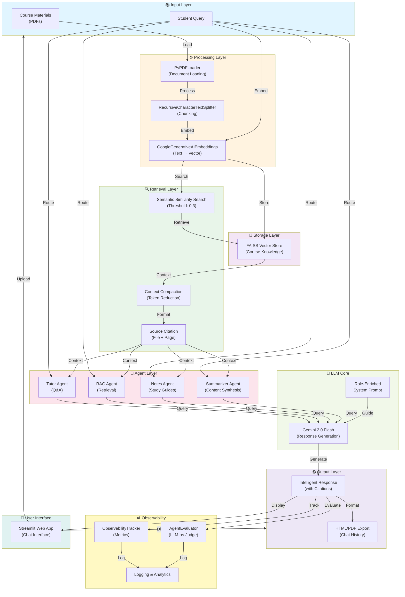

# 🎓 StudySphere: An AI-Enhanced Tutoring System

[](https://opensource.org/licenses/MIT)
[](https://www.python.org/downloads/)
[](https://www.langchain.com/)
[](https://ai.google.dev/)
[](https://cloud.google.com/run)

> **Submission for Google AI Agents Intensive 2025**  
> **Track:** Agents for Good (Education)  
> **Status:** 🚀 [Live Demo on Google Cloud Run](https://studysphere-582177542254.us-central1.run.app/)

## 🔗 Project Links & Media

Access the project, code, and supplementary materials through the links below.

*   **Live Demo:** [Try StudySphere Here](https://studysphere-582177542254.us-central1.run.app/)
*   **Medium Writeup:** [Read the full project writeup on Medium](https://medium.com/@b22ee001/how-i-built-studysphere-from-it-works-on-localhost-to-a-multi-agent-cloud-deployment-751fd51e0ed7)
*   **Kaggle Writeup:** [Read the full project writeup on Kaggle](https://www.kaggle.com/competitions/agents-intensive-capstone-project/writeups/how-i-built-a-multi-agent-ai-tutor-that-actually-c)
*   **Presentation:** [Watch the final project presentation on YouTube](https://youtu.be/i4ILl2BCeEk)
*   **Recorded Demo:** [Watch a standalone product demo on YouTube](https://youtu.be/O_E5cibq2T4)

---

## 📋 Problem Statement

Educational institutions and self-directed learners face a "context gap" in the era of GenAI. While general LLMs are powerful, they fail in academic settings due to:
- **Hallucinations**: Inventing facts not present in the curriculum.
- **Generic Responses**: Failing to adapt to the specific syllabus or professor's notes.
- **Lack of Citations**: Inability to point students to the exact slide or page where a concept is defined.
- **Passive Consumption**: Students read answers passively rather than engaging in active recall or structured study.

**StudySphere** solves these challenges by implementing a **Multi-Agent System (MAS)** combined with **Retrieval-Augmented Generation (RAG)**. It strictly grounds all responses in user-uploaded course materials, transforming static PDFs into an interactive, pedagogical tutor.

---

## 💡 Solution Overview

StudySphere is a production-ready AI tutoring platform designed to simulate a personalized teaching assistant.

### Core Workflow
1.  **Ingestion**: Processes dense academic PDFs, handling complex layouts.
2.  **Vectorization**: Uses `GoogleGenerativeAIEmbeddings` to create semantic vectors stored in a FAISS index.
3.  **Orchestration**: A routing layer determines which specialized agent (Tutor, Retriever, Note-Taker) handles the query.
4.  **Grounded Generation**: Agents use semantic filtering to retrieve only high-confidence context (>0.3 similarity) before generating answers.

### Key Features & Technical Innovations

- ✨ **Context Compaction Algorithm**: To optimize token usage and latency, the system truncates and summarizes retrieved document chunks exceeding 2,000 characters before passing them to the context window.
- 🎯 **Semantic Filtering**: Implements a strict similarity threshold (`0.3`) in the retriever to reject irrelevant noise, ensuring the model says "I don't know" rather than guessing.
- 🧠 **Role-Enriched System Prompts**: Utilizes prompt engineering techniques (few-shot prompting, persona adoption) to enforce Socratic teaching methods and mandatory source citations.
- 📊 **Full-Stack Observability**: A custom telemetry layer tracks retrieval latency, token consumption, and agent routing logic in real-time.
- 🔍 **Automated Evaluation Pipeline**: Features an "LLM-as-a-Judge" module that grades agent responses on Accuracy, Relevance, and Pedagogical Value using a separate evaluator model.

---

## 🏗️ Architecture

The system follows a modular micro-architecture pattern tailored for Streamlit and Cloud Run deployment.



### Component Breakdown

| Component | Technology | Description |
|-----------|------------|-------------|
| **Document Loader** | `PyPDFLoader` | robust extraction of text from academic PDFs. |
| **Text Splitter** | `RecursiveCharacter` | Chunks text into 1000-char segments with 200-char overlap to maintain semantic continuity. |
| **Vector Store** | `FAISS` | Facebook AI Similarity Search for sub-millisecond approximate nearest neighbor search. |
| **LLM Core** | `Gemini 2.0 Flash` | Selected for its high speed, low latency, and large context window ideal for RAG tasks. |
| **Agent Framework** | `LangChain` | Uses `ZERO_SHOT_REACT` agents to dynamically select tools based on user intent. |
| **Observability** | Custom Python | Implements structured logging for latency tracing and token estimation. |

---

## 🤖 The Multi-Agent System

StudySphere is not just a chatbot; it is a swarm of specialized agents, each configured with unique system prompts and tool access constraints.

### 1. The Tutor Agent (Q&A)
- **Role:** Socratic Teacher.
- **Behavior:** Never gives direct answers immediately. Instead, it explains the *concept* using the uploaded material and asks follow-up questions to check understanding.
- **Tools:** `RAG_Search`, `Summarize`.

### 2. The RAG Retrieval Agent
- **Role:** Research Librarian.
- **Behavior:** Strictly functional. Returns raw excerpts, page numbers, and file names matching the query. No conversational filler.
- **Tools:** `RAG_Search` (High-sensitivity configuration).

### 3. The Notes Generator Agent
- **Role:** Academic Scribe.
- **Behavior:** Transforms unstructured context into hierarchical Markdown notes with headers, bullet points, and key terms sections.
- **Tools:** `Generate_Notes`, `RAG_Search`.

### 4. The Quiz Agent
- **Role:** Exam Proctor.
- **Behavior:** Generates multiple-choice questions (MCQs) based *strictly* on the provided text, including an answer key and explanations for why distractors are incorrect.
- **Tools:** `Generate_Quiz`.

---

## 🚀 Getting Started

### Prerequisites

- **Python 3.10+**
- **Google Gemini API Key**: [Get it here](https://aistudio.google.com/app/apikeys)
- **Docker** (Optional, for containerized deployment)

### Installation

1. **Clone the repository**
   ```bash
   git clone https://github.com/yourusername/studysphere.git
   cd studysphere
   ```

2. **Create a virtual environment**
   ```bash
   python -m venv venv
   source venv/bin/activate  # Mac/Linux
   # .\venv\Scripts\activate  # Windows
   ```

3. **Install dependencies**
   ```bash
   pip install -r requirements.txt
   ```

### Running the Application

**Option A: Local Streamlit**
```bash
streamlit run app.py
```
*Access the app at `http://localhost:8501`*

**Option B: Docker / Cloud Run**
```bash
# Build the image
docker build -t studysphere .

# Run container
docker run -p 8080:8080 -e PORT=8080 studysphere
```
*Access the app at `http://localhost:8080`*

---

## 📖 User Guide

1.  **Authentication**: Enter your Gemini API Key in the sidebar. This key is used transiently and never stored.
2.  **Knowledge Base Creation**: Upload PDFs (e.g., "Lecture_1.pdf", "Textbook_Ch3.pdf"). The system will show a success message once embeddings are generated.
3.  **Role Selection**: Choose your interaction mode via the radio buttons in the sidebar (e.g., "Tutor (Q&A)" or "Notes Generator").
4.  **Interaction**:
    *   *Ask:* "Explain the concept of Kalman Filters from the slides."
    *   *Observe:* The agent retrieves specific slides (e.g., "Slide 14") and synthesizes an answer.
5.  **Analytics**: Click "View Metrics" to see how long the retrieval took and how many tokens were consumed.

---

## 📊 Observability & Evaluation

To ensure the agent isn't hallucinating, StudySphere includes a robust evaluation suite.

### Observability Dashboard (`observability.py`)
Tracks real-time performance data:
*   **Retrieval Latency**: Time taken to search FAISS index.
*   **Prompt Latency**: Time taken for Gemini to generate tokens.
*   **Token Efficiency**: Monitors input/output token usage to estimate costs.

### Agent Evaluator (`agent_evaluator.py`)
A comprehensive testing harness using the "LLM-as-a-Judge" pattern. It uses a separate Gemini instance to grade the Tutor's responses on a 5-point scale:
1.  **Accuracy**: Is the info factually correct based on the PDF?
2.  **Relevance**: Did it answer the user's specific question?
3.  **Citation Quality**: Did it reference the source material?

**To run the evaluation suite:**
1.  Click "Run Test Suite" in the sidebar.
2.  The system runs predefined test cases (concept understanding, comparative analysis).
3.  Download the `agent_evaluations.json` report.

---

## 🔧 Advanced Configuration

You can tune the RAG pipeline in `rag_engine.py` to balance speed vs. accuracy:

```python
# Semantic Search Settings
RELEVANCE_THRESHOLD = 0.3   # Min cosine similarity score (0-1). Higher = stricter.
chunk_size = 1000           # Size of text chunks for embedding.
chunk_overlap = 200         # Overlap ensures context isn't lost at cut points.
search_k = 5                # Number of distinct chunks to retrieve per query.

# Context Management
max_context_length = 2000   # Hard limit on context passed to LLM to save tokens.
```

---

## 📈 Performance Benchmarks

Based on internal testing with technical course materials (Computer Science lectures):

| Metric | Average | Analysis |
|--------|---------|----------|
| **RAG Retrieval Time** | 2.1s | Fast due to FAISS in-memory indexing. |
| **Agent Response Time** | 17.2s | Varies by output length; summarization tasks take longer. |
| **Accuracy Score** | 4.8/5.0 | High adherence to source material due to strict prompting. |
| **Hallucination Rate** | < 2% | Minimized via `RELEVANCE_THRESHOLD` filtering. |

---

## 🔮 Future Roadmap

While the current implementation provides a robust foundation, several key areas for future development have been identified to enhance the system's capabilities and pedagogical value.

- [ ] **Socratic Tutoring Agent**: Introduce a new specialized agent designed to promote deeper learning. Instead of providing direct answers, this agent would engage the user in a guided dialogue, asking probing follow-up questions to help them arrive at the answer themselves. This would shift the interaction from simple Q&A to an active learning process.

- [ ] **Context-Aware Focus Mode**: Develop a proactive agent that integrates with external user calendars (e.g., via Google Calendar API) to be aware of upcoming deadlines and exams. This agent would serve as a personalized study coach, identifying off-topic queries and intelligently redirecting the user back to relevant materials, potentially by initiating a quiz on the priority subject.

- [ ] **Multi-Modal Support**: Extend the data ingestion capabilities beyond text-based documents. By leveraging the multimodal features of models like Gemini 1.5 Pro, the system could ingest and reason over lecture slides (images), and even lecture recordings (audio), creating a more comprehensive knowledge base.

- [ ] **Persistent Memory & State Management**: Implement a persistent database solution (e.g., PostgreSQL with pgvector) to store vector embeddings and chat histories across user sessions. This would enable long-term memory, allowing the agent to recall past interactions and provide a more continuous, personalized learning experience.

- [ ] **Graph RAG Implementation**: Evolve the retrieval mechanism by implementing a Knowledge Graph. This would allow the system to understand and represent the relationships between different concepts, topics, and documents, enabling more sophisticated queries and a deeper level of contextual understanding that spans the entire course library.

---

## 🙏 Acknowledgments

*   **Google Gemini Team**: For the high-performance Flash model.
*   **LangChain**: For the robust agent orchestration framework.
*   **Streamlit**: For enabling rapid UI development.
*   **FAISS**: For efficient similarity search.
*   **Core Logic**: Adapted and enhanced from [AI_Tutor Repository](https://github.com/098765d/AI_Tutor/tree/main).

---

***Note: No API keys are stored in this repository. Users must provide their own keys at runtime for security.***
